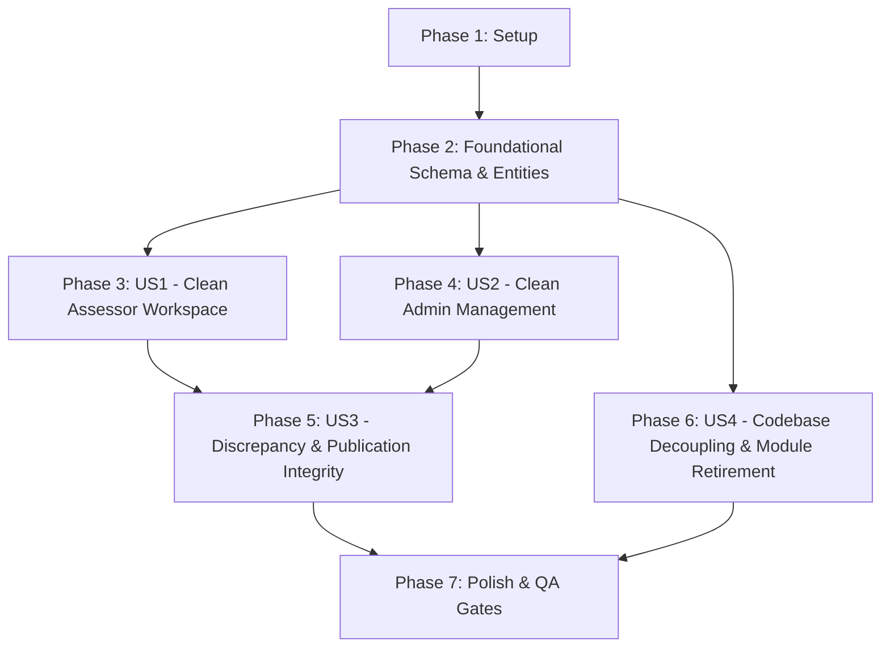

# Tasks: Removal of AI Prefill and AI Capabilities from Portal

**Feature Directory**: `specs/013-remove-portal-ai`  
**Plan**: [plan.md](./plan.md)  
**Spec**: [spec.md](./spec.md)  
**Created**: 2026-08-26  
**Status**: Completed

---

## Execution Dependencies & Strategy

- **MVP Scope**: Phases 1 through 4 (Clean Assessor Workspace + Clean Admin Project Management).
- **Parallel Opportunities**: All tasks marked `[P]` operate on distinct files and can be executed concurrently.

---

## Phase 1: Setup

- [X] T001 Inspect workspace state and ensure no running background AI processes conflict with portal database in `src/portal/`
- [X] T002 Verify baseline unit test status by running `pytest tests/unit/test_ui_quality_checks.py`

---

## Phase 2: Foundational (Data Model & Schema Clean-up)

**Goal**: Modernize persistence schema and domain entities by dropping obsolete prefill tables and removing AI telemetry fields from human submissions.

- [X] T003 [P] Update `HumanAssessorSubmission` dataclass in `src/shared/state/entities.py` to remove `ai_suggested_answer` and `ai_suggestion_accepted` fields
- [X] T004 [P] Update database DDL in `src/shared/persistence/schema.py` to remove `prefills` and `prefill_candidates` tables, remove AI columns from `human_submissions`, and add drop table safety statements to `init_db()`
- [X] T005 Update repository SQL queries in `src/shared/persistence/repositories.py` (`insert_human_submission`, `latest_human_submission`, `list_human_submissions`) to match the cleaned schema

---

## Phase 3: User Story 1 - Clean Human Assessor Workspace (Priority: P1)

**Goal**: Provide human assessors with a clean, unbiased questionnaire workspace free of AI suggestions, confidence meters, bot alerts, and adoption buttons.  
**Independent Test**: Load `/assessor/{cycle_id}/{portal_id}?role=A` and verify zero AI elements appear; submit findings and verify pure human submission storage.

- [X] T006 [P] [US1] Clean `src/portal/templates/assessor_unit.html` by removing AI suggestion cards, confidence meters, resolver characterizations, fallback alert boxes, and "Use AI Suggestion" buttons
- [X] T007 [P] [US1] Update assessor route handler in `src/portal/assessor.py` (`assessor_unit`) to eliminate `r.latest_prefill` query and `prefill_dict` (`row.ai`) construction
- [X] T008 [US1] Update `submit_answer` handler in `src/portal/assessor.py` to record human submissions directly without evaluating or storing AI suggestion match telemetry
- [X] T009 [US1] Verify assessor UI rendering and submission flow with unit tests in `tests/unit/test_assessor_completion.py`

---

## Phase 4: User Story 2 - Clean Administrator Management Dashboard (Priority: P1)

**Goal**: Streamline administrative survey cycle and unit management by eliminating AI run cards and execution trigger buttons.  
**Independent Test**: Load `/admin/projects/{cycle_id}`, verify clean 2-column status grid (`Assessor Declarations` and `Assessor A/B Discrepancy`), and confirm MSQ PDF upload works without AI candidate extraction.

- [X] T010 [P] [US2] Refactor `src/portal/templates/admin_project_detail.html` unit card status grid from 3 columns to 2 columns (`grid-2`) showing `Assessor Declarations` and `Assessor A/B Discrepancy`, and remove the "Trigger AI Assessment" button form
- [X] T011 [P] [US2] Update `_build_unit_rows` in `src/portal/admin.py` to remove `job_status` AI execution calls and `prefill_summary` / `st.summary` dict construction
- [X] T012 [US2] Remove `POST /admin/projects/{cycle_id}/units/{portal_id}/assess` route from `src/portal/admin.py`
- [X] T013 [US2] Simplify `upload_msq_pdf` in `src/portal/admin.py` to store MSQ reference documents without calling `match_msq_links` or inserting prefill candidates
- [X] T014 [US2] Verify admin project detail page rendering and MSQ upload with unit tests in `tests/unit/test_ui_quality_checks.py`

---

## Phase 5: User Story 3 - Human Discrepancy Reconciliation & Publication Integrity (Priority: P1)

**Goal**: Guarantee that 100% human-driven double-blind assessment, completion declarations, dynamic discrepancy detection, the Reconciliation Workspace (Spec 012), and Senior Reviewer publication remain fully operational.  
**Independent Test**: Drive two assessors through conflicting indicator submissions, verify Reconciliation Workspace opens at mutual completion, settle joint answers, and publish final scorecard.

- [X] T015 [P] [US3] Verify that `src/portal/discrepancy.py`, `src/portal/reconciliation.py`, and `src/portal/tolerance.py` operate purely on human submissions without any prefill dependencies
- [X] T016 [P] [US3] Verify that `src/api/finalize.py` and `src/portal/admin.py` publish scorecards accurately from human submissions and settled joint answers
- [X] T017 [US3] Run discrepancy and joint answer regression test suite in `tests/unit/test_portal_discrepancy.py` and `tests/unit/test_joint_answers.py`

---

## Phase 6: User Story 4 - Codebase Decoupling & Module Retirement (Priority: P2)

**Goal**: Remove obsolete portal AI worker files, update seed routines, and eliminate dead import references across the portal package.  
**Independent Test**: Verify file deletion of `live_prefill.py`, verify `python src/portal/seed.py` runs cleanly, and check that no dead prefill imports remain in `src/portal/`.

- [X] T018 [P] [US4] Delete obsolete portal background runner file `src/portal/live_prefill.py`
- [X] T019 [P] [US4] Update `src/api/runner.py` to decouple from `portal.live_prefill`
- [X] T020 [P] [US4] Clean `src/portal/seed.py` to seed human assessor submissions directly without querying or generating AI prefills
- [X] T021 [US4] Audit all imports in `src/portal/` to ensure zero remaining references to `PrefillReason`, `prefill_reason_tag`, `live_prefill`, or `prefills` table

---

## Phase 7: Polish & Quality Gates

**Goal**: Validate full system health against UI/UX anti-slop rules, WCAG contrast standards, and test suites.

- [X] T022 [P] Run zero-emoji and accessibility validation across templates in `tests/unit/test_ui_quality_checks.py`
- [X] T023 Run full automated pytest test suite (`pytest tests/unit`) to ensure 100% test pass rate
- [X] T024 Validate quickstart manual testing scenarios per `specs/013-remove-portal-ai/quickstart.md`
